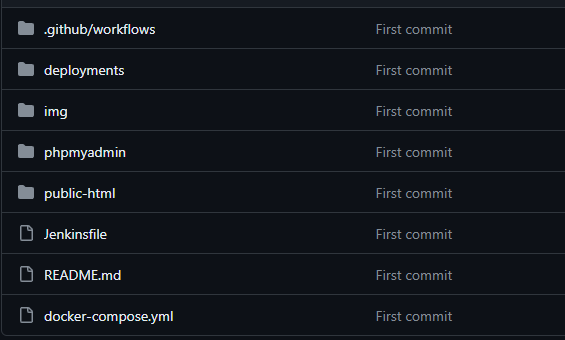
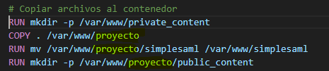
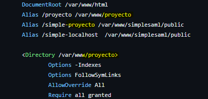
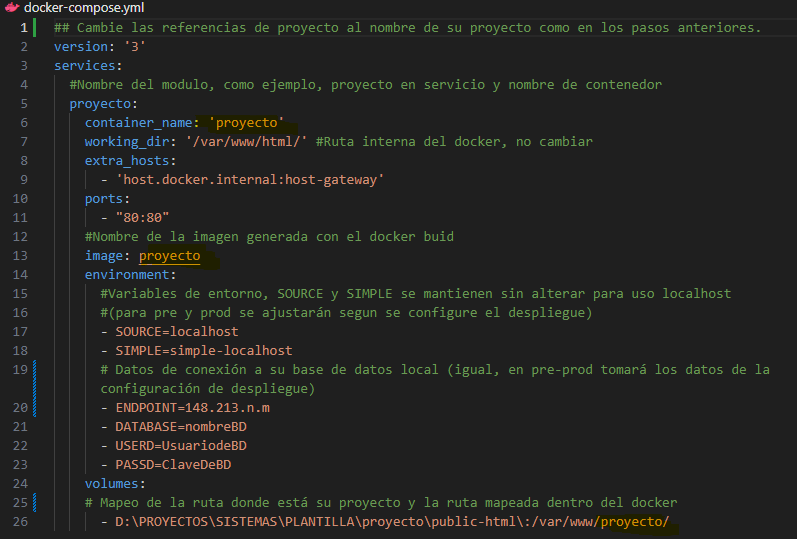
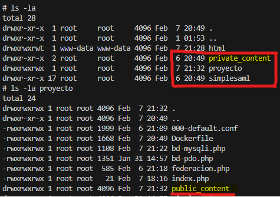
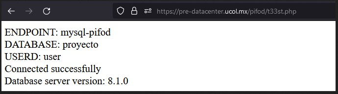
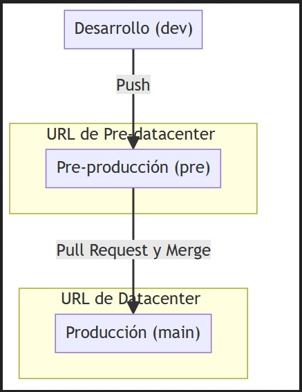
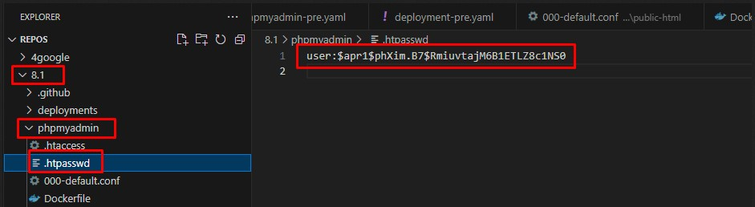
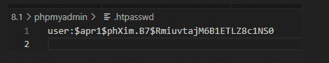

## COMO USARLO

1.- Clonar repo
```
 git clone https://github.com/sistemas-ucol-mx/plantilla-despliegue
```
2.-  Copia el código de tu proyecto en la carpeta public-html
  

<!-- 3.- En el public-html/Dockerfile cambia proyecto por el nombre de tu proyecto (ej, sibeucol)
   -->

3.- En el public-html/000-default.conf cambia proyecto por el nombre de tu proyecto (ej, sibeucol)
  

4.- Construye la imagen del contenedor
```
 docker build .....
```

5.- Crea una copia del archivo .env.example a .env y actualiza tu archivo de env con los datos correspondientes.
  <!--  -->


6.- Levanta el servicio.
```
 docker-compose up
```

7.- Consulta el contenido en su navegador
```
 http://localhost/proyecto/
```

5.- Revisa los ejemplos contenidos en la carpeta public-html:
 - federacion.php (conexión con la federación ucol)
 - bd-pdo.php (conexión a BD)
 - bd-mysqli.php (conexión a BD)


## PARA PRE-PROD

**Structure inside the container and public-hmtl folder for preproduction environment:**



Routes:
(phpmyadmin): https://pre-datacenter.ucol.mx/admin-proyecto/

(public-html): https://pre-datacenter.ucol.mx/proyecto/

(simplesaml): https://pre-datacenter.ucol.mx/simple-proyecto/

**Probar conectividad con base de datos en local:**
http://localhost/proyecto/bd-pdo.php
http://localhost/proyecto/bd-mysqli.php




<br> <!-- This adds a line break -->

**To get the source, mysql endpoint, database user, password user and database name, you have environment variables:**

1.- `echo $SOURCE`

2.- `echo $ENDPOINT`

3.- `echo $DATABASE`

4.- `echo $USERD`

5.- `echo $PASSD`

6.- `echo $SIMPLE`

<br> <!-- This adds a line break -->

**Flujo del Proceso:**

- **Desarrollo (dev):** Cambios y desarrollos iniciales.
    - `Push → dev`

- **Pre-producción (pre):** Pruebas y validación final antes de producción. (url de pre-datacenter)
    - `Pull Request y Merge → de dev a pre`

- **Producción (main):** Despliegue de cambios validados a los usuarios finales. (url de datacenter - cuando se validen y aprueben los cambios)
    - `Pull Request y Merge → de pre a main`




<br> <!-- This adds a line break -->
<br> <!-- This adds a line break -->
**How to create the htpassword:**
Modify the .htpassword file:



**Generate new password in Linux interface:**
```bash
openssl passwd -apr1 "psswrd-p1f0dsd-user!"
```

**Copy the result and modify inside the .htpassword file:**

